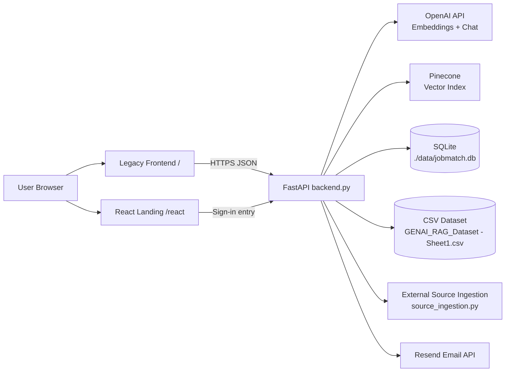
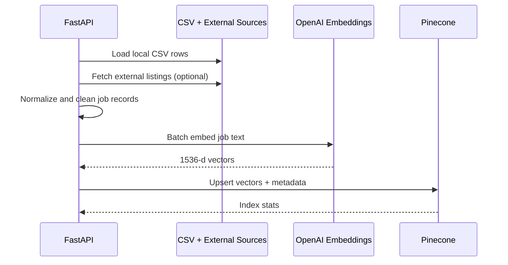
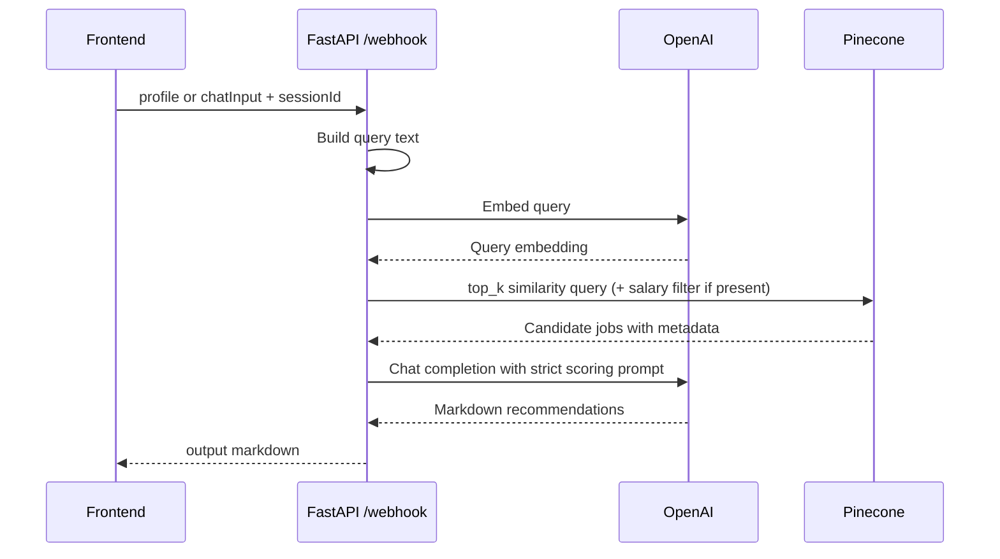

# JobMatch AI Architecture

## 1) System Overview

JobMatch AI is a FastAPI-based RAG application that matches candidate profiles to job listings. It combines:

- Retrieval: Pinecone vector search over embedded job listings
- Generation: OpenAI chat model to rank, explain, and format top matches
- Persistence: SQLite for user-facing workflow data (bookmarks, feedback, resume analyses)
- UI surfaces:
  - Legacy HTML/JS dashboard (served by FastAPI at `/`)
  - React landing experience (served by FastAPI at `/react` when built)

Primary runtime entry point: `backend.py`

---

## 2) High-Level Architecture

---

## 3) Repository Component Map

- `backend.py`
  - Main application lifecycle, API endpoints, RAG pipeline, auth checks, and static file mounting
- `source_ingestion.py`
  - Optional external job source connectors and normalization into backend-compatible records
- `frontend/`
  - Legacy production dashboard (form submission, resume upload, bookmarking, enhancement tooling)
- `frontend-react/`
  - React/Vite landing site; build step also copies legacy `frontend` into `dist/app`
- `data/`
  - SQLite database storage directory
- `requirements.txt`
  - Python dependencies
- `Dockerfile`
  - Container definition (currently contains legacy path assumptions; see Notes section)

---

## 4) Backend Runtime Design

### 4.1 Startup and Lifespan

On startup (`lifespan`):

1. Initializes SQLite tables if they do not exist.
2. If OpenAI and Pinecone keys are present, tries non-forced indexing (`index_dataset(force=False)`).
3. Mounts static assets:
   - `/react` if `frontend-react/dist` exists
   - `/` from `frontend` if available
   - fallback JSON root if frontend assets are missing

### 4.2 Core Dependencies and Patterns

- Lazy singleton clients:
  - OpenAI client created on first use
  - Pinecone client created on first use
- In-memory caching:
  - Search result cache via TTL cache (10 minutes)
- In-memory session history:
  - Per-session conversational context with 60-minute TTL
- Optional request rate limiting:
  - Enabled when `slowapi` is installed (`10/minute` on `/webhook`)

---

## 5) RAG Pipeline

### 5.1 Indexing Flow

### 5.2 Query + Generation Flow

### 5.3 Ranking Prompt Strategy

The generation prompt enforces:

- Strict 0-10 fit scoring
- Explicit match rationale and gap reporting
- Top-N selection (`TOP_N_RESULTS`)
- Deterministic output structure in markdown

This prevents vague outputs and keeps the frontend rendering predictable.

---

## 6) Data and Storage Architecture

### 6.1 Pinecone Vector Metadata

Each indexed job vector stores key metadata such as:

- Role/title/company/location/work type
- Salary text and derived `salary_min`
- Qualifications, skills, benefits
- Source and external URL

This metadata supports retrieval display and optional filtering.

### 6.2 SQLite Tables

The application initializes and uses:

- `bookmarks`: user-saved jobs by `session_id`
- `feedback`: job feedback and ratings
- `applications`: workflow status tracking (table exists for extended flow)
- `alert_subscriptions`: alert preferences (table exists for extended flow)
- `resume_enhancements`: AI resume audit results
- `resume_tailoring`: per-job tailoring analyses

---

## 7) API Surface by Capability

### 7.1 Core Matching

- `GET /health`
- `POST /webhook`
- `POST /index?force=true|false`

### 7.2 Resume + Content Generation

- `POST /parse-resume` (PDF -> structured profile)
- `POST /cover-letter`
- `POST /enhance-resume`
- `POST /tailor-resume`
- `POST /keyword-gap`
- `GET /resume-enhancements/{session_id}`
- `GET /resume-tailoring/{session_id}`

### 7.3 User Workflow

- `POST /bookmark`
- `GET /bookmarks/{session_id}`
- `POST /feedback`
- `POST /send-results`

### 7.4 Frontend Compatibility Routes

- `GET /react` -> redirects to `/react/`
- `GET /app` and `GET /app/` -> redirect to `/`

---

## 8) Frontend Architecture

### 8.1 Legacy Dashboard (`frontend/`)

The HTML/JS dashboard:

- Persists a session id in local storage
- Sends profile-based requests to `/webhook`
- Uploads PDF resumes to `/parse-resume`
- Calls `/send-results`, `/bookmark`, and resume tooling endpoints
- Uses `config.js` for API base URL and API key

### 8.2 React Landing (`frontend-react/`)

The React app is a landing/navigation layer. Build behavior (`vite.config.js`) includes:

- Standard Vite React build to `dist`
- Custom post-build copy of `frontend/` into `dist/app`

This allows one deployment artifact to host both landing and legacy app experiences.

---

## 9) Security and Access Model

### 9.1 API Key Gate

Most data-modifying or AI endpoints require `X-Api-Key` when `JOBMATCH_API_KEY` is configured.

### 9.2 JWT Handling in Current Root Backend

Current root backend uses API-key dependency checks but does not enforce JWT bearer validation on endpoints.

Note: legacy code previously included JWT-oriented paths; that code was removed during workspace cleanup and is not part of current runtime.

### 9.3 CORS

CORS origins come from `ALLOWED_ORIGINS` (comma-separated). Default is permissive if unset.

---

## 10) Configuration Model

### 10.1 Critical Environment Variables

- `OPENAI_API_KEY`
- `PINECONE_API_KEY`
- `PINECONE_INDEX`
- `PINECONE_CLOUD`
- `PINECONE_REGION`
- `OPENAI_CHAT_MODEL`
- `TOP_K`
- `TOP_N_RESULTS`
- `CSV_PATH`
- `DB_PATH`
- `JOBMATCH_API_KEY`
- `ALLOWED_ORIGINS`
- `RESEND_API_KEY`
- `FROM_EMAIL`

### 10.2 External Source Variables

`source_ingestion.py` supports providers (for example USAJOBS, Adzuna, Remotive, Arbeitnow, Jooble, Greenhouse, Lever) when provider-specific keys/tokens are set.

---

## 11) Operational Characteristics

### 11.1 Performance

- Parallel embedding batches during indexing
- Pinecone retrieval latency dominates search path
- OpenAI chat completion latency dominates generation path
- TTL cache reduces repeated search cost for identical queries

### 11.2 Fault Tolerance

- Global exception handler returns standard 500 payloads
- Endpoint-level `HTTPException` for user-facing validation and dependency errors
- Optional dependency behavior:
  - If `pdfplumber` missing: resume parsing endpoints return 503
  - If `resend` missing or not configured: email endpoint returns 503

### 11.3 Data Consistency

- SQLite writes are transactional per request
- Vector index updates are idempotent with stable vector IDs

---

## 12) Current Constraints and Notes

1. Build/deploy drift:
   - `Dockerfile` currently references removed nested paths (`Aadit_Ananya_RAG/rag/...`).
   - Runtime source-of-truth now lives at repository root.
2. Frontend config defaults to localhost API (`frontend/config.js`), so production hosting requires value injection/replacement.
3. Session chat history is in-memory only and not durable across process restarts.
4. Startup indexing behavior depends on API key presence and index state; production may prefer manual `POST /index?force=true`.

---

## 13) Recommended Evolution Path

1. Normalize deployment files to root paths only (Docker and docs).
2. Introduce explicit JWT validation if multi-user auth is required.
3. Move session history from memory to persistent storage for horizontal scale.
4. Add endpoint-level tests for resume tooling and send-results flows.
5. Split backend into modules (`routes`, `services`, `repositories`) as complexity grows.

---

## 14) Quick Architecture Checklist

- RAG retrieval and generation integrated: Yes
- Structured persistence for user workflow: Yes
- Frontend served by backend for local/simple deploy: Yes
- Production-ready auth hardening: Partial (API key present, JWT not enforced in current root backend)
- Deployment config fully aligned with cleaned repository layout: Not yet
